# Simple MacOS Web |  


> A high-performance, browser-based operating system simulation built entirely from scratch without relying on any front-end frameworks. It faithfully replicates the macOS desktop environment, complete with an in-memory Virtual File System, hardware-accelerated window management, and a suite of fully functional integrated applications. Designed as a comprehensive technical showcase, it pushes the limits of Vanilla JavaScript and DOM manipulation to deliver a fluid, 60fps native-like experience.


<table align="center" style="border: none; background-color: transparent;">
  <tr style="border: none; background-color: transparent;">
    <td align="center" width="50%" style="border: none; background-color: transparent;">
      
    </td>
    <td align="center" width="50%" style="border: none; background-color: transparent;">
      
    </td>
  </tr>
</table>

<p align="center">
  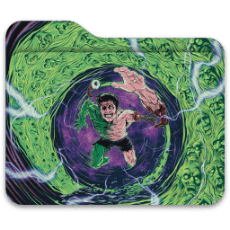
  &nbsp;&nbsp;
  
  &nbsp;&nbsp;
  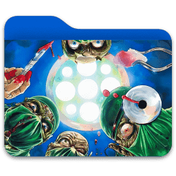
  &nbsp;&nbsp;
  
  &nbsp;&nbsp;
  
  &nbsp;&nbsp;
  
  &nbsp;&nbsp;
  
  &nbsp;&nbsp;
  
  &nbsp;&nbsp;
  
  &nbsp;&nbsp;
  
</p>
<br>

## Live Demo & Visual Analysis 

The interface is designed as a **Pixel-Perfect Glassmorphism Dashboard**, providing real-time feedback on algorithmic DOM manipulation and CSS3 hardware acceleration.

<p align="center">
  <video src="assets/WebOS_Demo.mp4" width="600" controls title="WebOS Live Demo"></video>
</p>
<br>

[**Try the Live Demo**](https://vor7rex.github.io/Web_MacOS/)<a href="https://pokemondb.net/pokedex/keldeo"></a>
</a>

## System Architecture & Core Engineering 

Simple MacOS Web is built with a strict separation of concerns, relying entirely on native browser APIs to achieve 60fps performance without the overhead of heavy frameworks like React or Vue.

* **State Management & VFS:** A JSON-based Virtual File System tracks spatial coordinates, z-index layering, and app lifecycles. It drives the cross-environment drag-and-drop engine, enabling seamless file transfers between the Desktop, Finder, and Trash with dynamically generated 3D holograms.

* **Rendering Pipeline & GPU Acceleration:** UI updates bypass CPU layout thrashing. Window dragging, dock magnification, and FLIP-driven animations (Music App) leverage `transform` and `will-change` for pure GPU rasterization. The Zero-Lag Theme Engine uses a Double `requestAnimationFrame` lock, synchronizing CSS variable swaps with the monitor's V-Sync to eliminate flicker.

* **Spatial Collision & Trigonometric UI:** Multi-file selection is powered by a custom AABB (Axis-Aligned Bounding Box) collision engine with spatial DOM caching. Complex UI elements, like context menus and folder color selectors, are generated on the fly using radial math and trigonometry.

* **Hardened Security Sandbox:** Enforces a strict Content Security Policy (CSP). Includes an `eval()`-free custom mathematical lexer for the Calculator, and an XSS-proof Bash Terminal emulator that rigidly sanitizes all VFS inputs.

<br>

## Technologies

| **Core Stack** | **Implementation Details** |
| :--- | :--- |
|  | Core OS engine (ES6+), Event throttling, DocumentFragments, AABB collision math |
|  | Glassmorphism (`backdrop-filter`), CSS Grid/Flexbox layouts, Dark/Light theming |
|  | Semantic structure, HTML5 Audio API for music playback, File API for uploads |
|  | Vector mapping and geospatial rendering in the Maps App (via CartoDB Voyager) |
<br>


## Algorithmic Core & Telemetry 

The engine continuously monitors and optimizes browser rendering pipelines to guarantee an uncompromising 60fps experience:

1. **Layout Thrashing Prevention:** Mathematical state operations are completely decoupled from DOM repaints. Window resizing and the Marquee Tool utilize independent `requestAnimationFrame` batches, ensuring layout calculations never block the main thread.

2. **JIT Memory Management:** Passive CPU drain is eliminated. Heavy spatial event listeners (e.g., `mousemove` for window dragging) are Just-In-Time attached on `mousedown` and surgically destroyed on `mouseup`, preventing garbage collection spikes.

3. **V-Sync Theme Engine:** Zero-flicker Dark/Light mode transitions. A Double `requestAnimationFrame` lock pauses UI threads, forces global CSS variable recalculation, and executes the repaint exactly when the GPU confirms the next frame buffer.

<br>


## App Ecosystem & Technical Deep Dive &nbsp;       

| App | Description & Experience | Engineering Highlight |
| :--- | :--- | :--- |
| **Finder** <br> 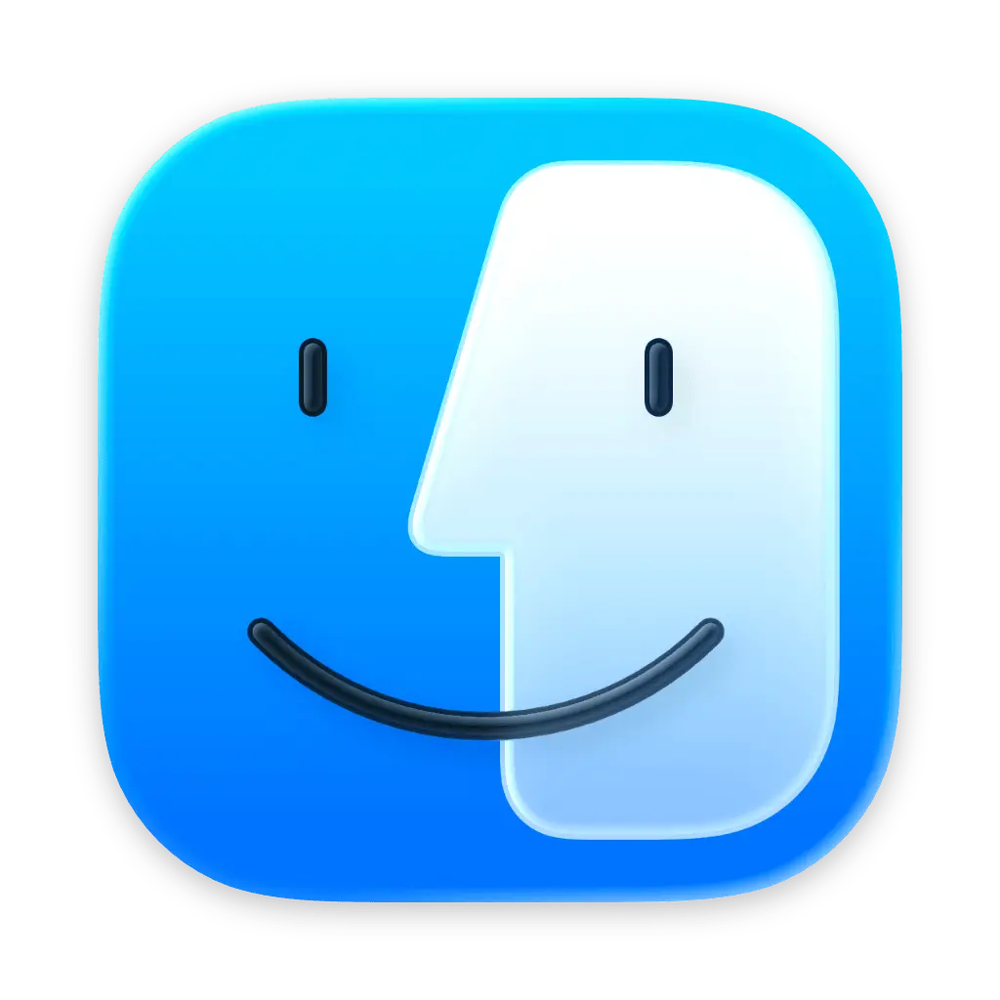 | Core file manager for VFS navigation and file preview. | **3D Radial Math:** Dynamic folder color selection via trigonometric UI rendering. |
| **Terminal** <br>  | Fully functional UNIX-like Bash shell emulator. | **Security:** Implements a custom input parser to neutralize XSS injection via VFS filenames. |
| **Music** <br>  | Professional HTML5 Audio player with Library and Artist views. | **FLIP Technique:** Smooth list reordering and 3D orbiting playlist creator at 60fps. |
| **Calendar** <br>  | Dynamic monthly view with event management and popups. | **Collision Logic:** Intelligent lane allocation to prevent overlapping of multi-day events. |
| **Reminders** <br>  | Task manager with custom lists and advanced inspector. | **State Sync:** Real-time synchronization between sidebar counters and task categories. |
| **Maps** <br> 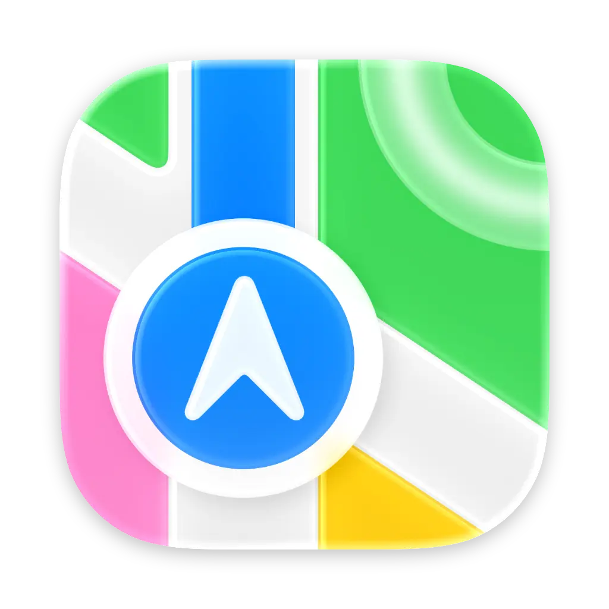 | Interactive GIS interface using CartoDB and OpenStreetMap. | **GIS Integration:** Managed Leaflet.js instance with asynchronous geocoding and smooth fly-to ops. |
| **Weather** <br>  | Real-time weather dashboard for global metropolises. | **Live API Pipeline:** Fetches and parses WMO codes from Open-Meteo with dynamic icon mapping. |
| **Calculator** <br>  | High-precision mathematical engine (BODMAS compliant). | **Custom Lexer:** Token-based parser that executes math without using dangerous `eval()` calls. |
| **Clock** <br>  | Analog and digital time tracking with time-zone support. | **GPU Sweep:** Trigonometric rotation logic synced to `Date.getMilliseconds()` for zero-jitter hands. |
| **Settings** <br>  | OS-level configuration and real-time hardware telemetry. | **Telemetry API:** Leverages `navigator` and `performance` APIs to monitor CPU, RAM, and Battery. |
| **Screenshot** <br>  | Full-screen DOM rasterization with Quick Look preview. | **DOM Canvas:** Uses `html2canvas` for visual buffer capturing and efficient Base64 RAM management. |
---

<br>

<table align="center" style="border: none; background-color: transparent;">
  <tr style="border: none; background-color: transparent;">
    <td align="center" width="50%" style="border: none; background-color: transparent;">
      
    </td>
    <td align="center" width="50%" style="border: none; background-color: transparent;">
      
    </td>
  </tr>
</table>
<p align="center">
  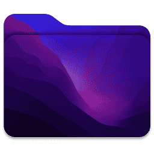
  &nbsp;&nbsp;
  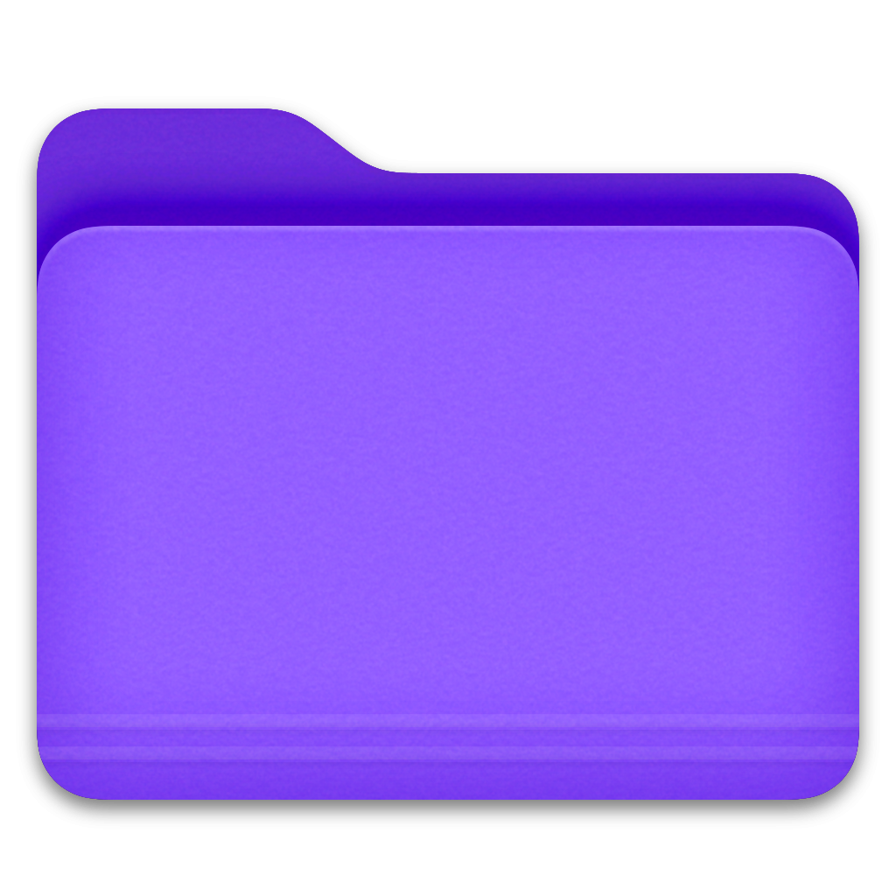
  &nbsp;&nbsp;
  
  &nbsp;&nbsp;
  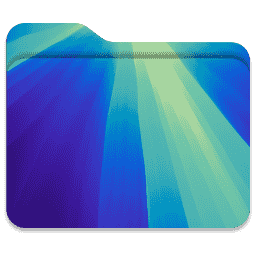
  &nbsp;&nbsp;
  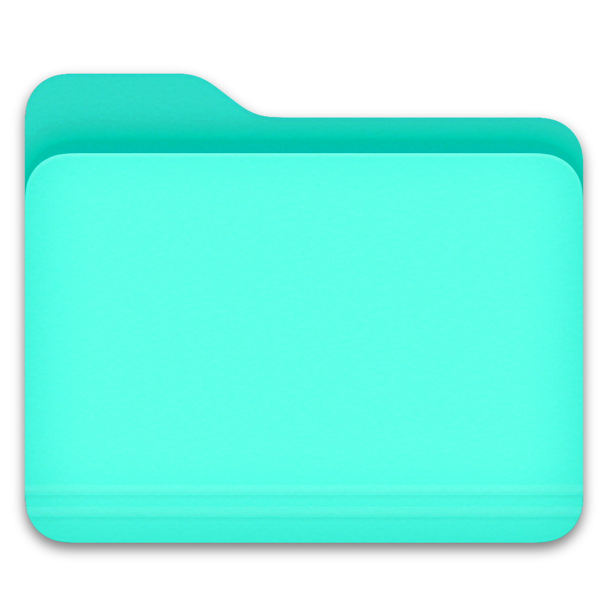
  &nbsp;&nbsp;
  
  &nbsp;&nbsp;
  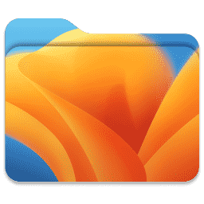
  &nbsp;&nbsp;
  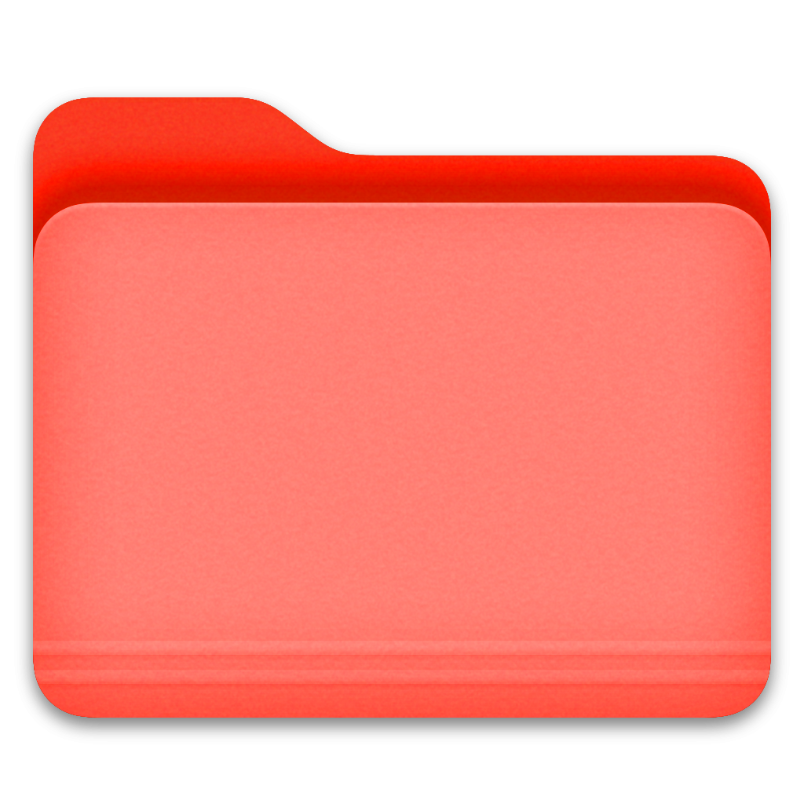
  &nbsp;&nbsp;
  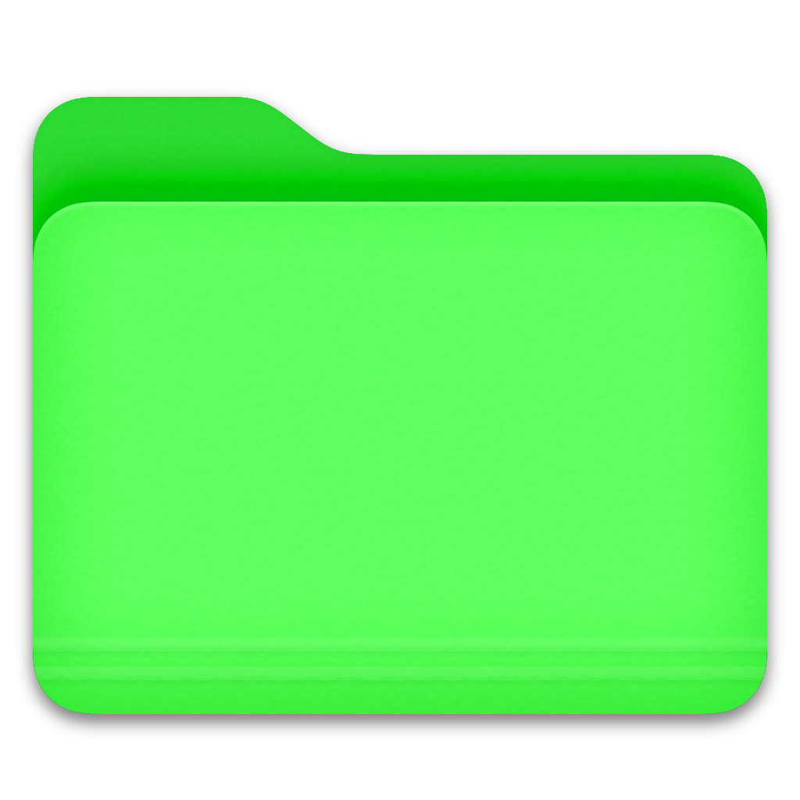
  &nbsp;&nbsp;
  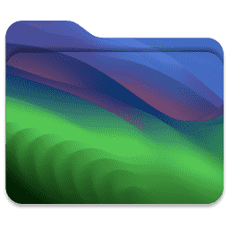
</p>

<br>

## Component Interaction Contract & Data Flow 

The operating system enforces strict inter-app communication protocols to prevent state mutation leaks and ensure DOM predictability:

*  **Single Source of Truth:** The Virtual File System acts as the core state manager. File operations (CRUD) broadcast state changes globally, triggering targeted UI repaints only for active subscribers (e.g., open Finder windows, Desktop grid).

*  **Z-Index Routing:** A centralized interceptor captures `mousedown` events across the viewport. It dynamically recalculates layer stacking, pushes the active instance to the top `z-index`, and manages focus states across the ecosystem.

*  **Native IPC Delegation:** Zero-dependency inter-process communication. Cross-environment events (e.g., dragging a file from the Desktop into the Trash) leverage native JS bubbling and capturing phases, bypassing the memory overhead of external state managers.

<br>    

## Quick Start  

The application requires absolutely no build tools, Node.js, or npm packages. It runs natively in any modern browser.

1. **Clone the infrastructure:**
    ```bash
    git clone [https://github.com/Vor7reX/Web_MacOS.git](https://github.com/Vor7reX/Web_MacOS.git)
    cd WebOS
2. **Launch the OS:**
   ```bash
    Simply double-click the `index.html` file. 
   ```

    *Note: For the best experience and to bypass local CORS restrictions (required for HTML5 Audio and fetching Map APIs), it is highly recommended to open the project using a local web server, such as the **Live Server** extension in VS Code.*

<br>

## Repository Structure 
```text
WebOS/
├── index.html               # Main OS interface & Application DOM templates
├── assets/
│   ├── css/
│   │   └── style.css        # CSS Tokens, Glassmorphism, UI Layouts
│   ├── js/
│   │   └── script.js        # Core Engine, VFS, Window Manager & Apps Logic
│   ├── audio/               # MP3 tracks for the Music App database
│   ├── icon/                # App icons, weather symbols, and UI vectors
│   ├── img/                 # Default wallpapers and album covers
│   └── cursors/             # Custom macOS style SVG cursors
└── README.md                # System documentation
```
<br>

## Engineering Roadmap 

* **Non-Volatile VFS Storage:** Migrating the current RAM-based state tree to the browser's `IndexedDB`, enabling persistent file system structures, application states, and UI coordinates across sessions.
* **Touch Event Abstraction:** Upgrading the pointer collision engine to seamlessly bridge native `MouseEvent` and `TouchEvent` APIs, guaranteeing fluid, 60fps drag-and-drop on mobile devices and iPads.
* **Socket-Driven Multiplayer:** Implementing a bi-directional WebSocket layer to support real-time cursor telemetry and remote cross-instance file dropping between users over the internet.

<br>

## Open Source Integrations 

This OS relies on pure Vanilla JS for its core architecture, but gratefully acknowledges the following APIs and libraries for extending its ecosystem:

* **[Leaflet.js](https://leafletjs.com/)** - Vector GIS rendering and map interactions.
* **[html2canvas](https://html2canvas.hertzen.com/)** - Visual buffer capturing for DOM rasterization.
* **[Open-Meteo API](https://open-meteo.com/)** - Live WMO weather telemetry.
* **[Nominatim (OSM)](https://nominatim.openstreetmap.org/)** - Asynchronous global geocoding.

*Assets & Media:* All audio tracks are original compositions generated via AI to ensure a 100% royalty-free multimedia experience. All album cover artworks are original designs created by me :) 

<br>

## 📄 License & Attribution &nbsp;

This project is open-source and released under the **MIT License**.

You are free to use, modify, and distribute this software, provided that **you include the original copyright notice and give proper credit** to the author.

<p align="center">
  <i>Engineered to push the limits of Vanilla Web Development. Zero frameworks, pure DOM.</i><br>
</p>

---
<div align="left">
<p valign="middle">
Created by <b>Vor7reX</b>

</p>
</div>